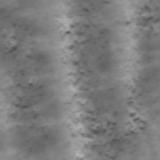

# IDDM：集成设计扩散模型
<div align="left">
    <a href="https://github.com/chairc/Integrated-Design-Diffusion-Model" target="_blank">
        
    </a>
    <a href="https://doi.org/10.5281/zenodo.10866128">
        
    </a>
    <a href="https://github.com/chairc/Integrated-Design-Diffusion-Model/blob/main/LICENSE" target="_blank">
        
    </a>
    <a href="https://github.com/chairc/Integrated-Design-Diffusion-Model/issues">
        
    </a>
    <a href="https://github.com/chairc/Integrated-Design-Diffusion-Model/releases" target="_blank">
        
    </a>
    <a href="#" target="_blank">
        
    </a>
</div>

<div align="left">
    <a href="https://github.com/chairc/Integrated-Design-Diffusion-Model/stargazers">
        
    </a>
    <a href="https://github.com/chairc/Integrated-Design-Diffusion-Model/forks" target="_blank">
        
    </a>
    <a href="https://gitee.com/chairc/Integrated-Design-Diffusion-Model">
        
    </a>
    <a href="https://gitee.com/chairc/Integrated-Design-Diffusion-Model">
        
    </a>
</div>

[English Document](README.md)


### 0 关于模型

该扩散模型为经典的ddpm、ddim和plms，来源于论文《**[Denoising Diffusion Probabilistic Models](https://arxiv.org/abs/2006.11239)**》、《**[Denoising Diffusion Implicit Models](https://arxiv.org/abs/2010.02502)**》和《**[Pseudo Numerical Methods for Diffusion Models on Manifolds](https://openreview.net/forum?id=PlKWVd2yBkY)**》。

我们将此项目命名为IDDM: Integrated Design Diffusion Model，中文名为集成设计扩散模型。在此项目中进行模型复现、训练器和生成器编写、部分算法和网络结构的改进与优化，该仓库**持续维护**。

如果有任何问题，请先到此[**issue**](https://github.com/chairc/Integrated-Design-Diffusion-Model/issues/9)进行问题查询，若无法解决可以加入我们的QQ群：949120343、开启新issue提问或联系我的邮箱：chenyu1998424@gmail.com/chairc1998@163.com。**如果你认为我的项目有意思请给我点一颗⭐⭐⭐Star⭐⭐⭐吧。**

**本仓库整体结构**

```yaml
Integrated Design Diffusion Model
├── config
│   ├── choices.py
│   ├── model_list.py
│   ├── setting.py
│   └── version.py
├── datasets
│   └── dataset_demo
│       ├── class_1
│       ├── class_2
│       └── class_3
├── deploy
│   ├── deploy_socket.py
│   └── deploy_server.py
├── model
│   ├── modules
│   │   ├── activation.py
│   │   ├── attention.py
│   │   ├── block.py
│   │   ├── conv.py
│   │   ├── ema.py
│   │   └── module.py
│   ├── networks
│   │   ├── sr
│   │   │   └── srv1.py
│   │   ├── base.py
│   │   ├── cspdarkunet.py
│   │   └── unet.py
│   ├── samples
│   │   ├── base.py
│   │   ├── ddim.py
│   │   ├── ddpm.py
│   │   └── plms.py
│   └── trainers
│       ├── base.py
│       ├── dm.py
│       └── sr.py
├── results
├── sr
│   ├── dataset.py
│   ├── demo.py
│   ├── interface.py
│   └── train.py
├── test
│   ├── noising_test
│   │   ├── landscape
│   │   └── noise
│   └── test_module.py
├── tools
│   ├── FID_calculator.py
│   ├── FID_calculator_plus.py
│   ├── generate.py
│   └── train.py
├── utils
│   ├── check.py
│   ├── checkpoint.py
│   ├── dataset.py
│   ├── initializer.py
│   ├── logger.py
│   ├── lr_scheduler.py
│   ├── metrics.py
│   ├── processing.py
│   └── utils.py
├── webui
│   └──web.py
└── weights
```


### 1 接下来要做

- [x] [2023-07-15] 增加多卡分布式训练
- [x] [2023-07-31] 增加cosine学习率优化
- [x] [2023-08-03] 增加DDIM采样方法
- [x] [2023-08-28] 云服务器快速部署和接口
- [x] [2023-09-16] 支持其它图像生成
- [x] [2023-11-09] 增加效果更优的U-Net网络模型
- [x] [2023-11-09] 支持更大尺寸的生成图像
- [x] [2023-12-06] 重构model整体结构
- [x] [2024-01-23] 增加可视化webui训练界面
- [x] [2024-02-18] 支持低分辨率生成图像进行超分辨率增强[~~超分模型效果待定~~]
- [x] [2024-03-12] 增加PLMS采样方法
- [x] [2024-05-06] 增加FID方法验证图像质量
- [x] [2024-06-11] 增加可视化webui生成界面
- [x] [2024-07-07] 支持自定义图像长宽输入
- [x] [2024-11-13] 增加生成图像Socket和网站服务部署
- [x] [2024-11-26] 增加PSNR和SSIM方法验证超分图像质量
- [x] [2024-12-10] 增加预训练模型下载
- [x] [2024-12-25] 重构训练器结构
- [ ] [预计2025-01-31] 增加Docker部署与镜像
- [ ] [待定] 重构项目利用百度飞桨框架
- [ ] [待定] ~~使用Latent方式降低显存消耗~~


### 2 训练

**训练前需注意**

本自README的训练GPU环境如下：使用具有6GB显存的NVIDIA RTX 3060显卡、具有11GB显存的NVIDIA RTX 2080Ti显卡和具有22GB（总计44GB，分布式训练）显存的NVIDIA RTX 6000（×2）显卡对模型进行训练和测试。**上述GPU均可正常训练**。

#### 2.1 开始你的第一个训练（以cifar10为例，模式单卡）

1. **导入数据集** 

   首先，将数据集上传至目标文件夹`datasets`中[**[issue]**](https://github.com/chairc/Integrated-Design-Diffusion-Model/issues/9#issuecomment-1882902085)。上传后文件夹格式（例如：cifar10文件夹下存放着所有类别；class0文件夹下存储着class0这个类别的所有图片）如下方列表所示：
   ```yaml
    datasets
    └── cifar10
        ├── class0
        ├── class1
        ├── class2
        ├── class3
        ├── class4
        ├── class5
        ├── class6
        ├── class7
        ├── class8
        └── class9
   ```

   此时你的训练前准备已经完毕。

2. **设置训练参数**

   打开`train.py`文件，修改`if __name__ == "__main__":`中的`parser`参数；

   设置`--conditional`参数为`True`，因为是多类别训练，所以需要开启，单类别可以不开启也可以开启；

   设置`--run_name`参数为你想创建的文件名称，例如`cifar_exp1`；

   设置`--dataset_path`参数为`/你的/本地/或/远程服务器/文件/地址/datasets/cifar10`；

   设置`--result_path`参数为`/你的/本地/或/远程服务器/文件/地址/results`；

   设置`--num_classes`参数为`10`，这是你的类别总数（**1.1.4版本后的模型可不用设置**）；

   设置更多参数（自定义），如果报`CUDA out of memory`错误，将`--batch_size`、`--num_workers`调小；

   在自定义参数中，你可以设置不同的`--sample`例如`ddpm`或`ddim`，设置不同的训练网络`--network`例如`unet`或`cspdarkunet`。当然激活函数`--act`，优化器`--optim`，混合精度训练`--amp`，学习率方法`--lr_func`等参数也都是可以自定义设置的。

   详细命令可参考**训练参数**。

3. **等待训练过程**

   点击`run`运行后，项目会在`results`文件夹中生成`cifar_exp1`文件夹，该文件夹中会保存训练日志文件、模型训练文件、模型EMA文件、模型优化器文件、训练的所有最后一次保存的文件和评估后生成的图片。

4. **查看结果**

   找到`results/cifar_exp1`文件夹即可查看训练结果。


**↓↓↓↓↓↓↓↓↓↓下方为多种训练方式、训练详细参数讲解↓↓↓↓↓↓↓↓↓↓**

#### 2.2 普通训练

##### 2.2.1 命令训练

1. 以`landscape`数据集为例，将数据集文件放入`datasets`文件夹中，该数据集的总路径如下`/your/path/datasets/landscape`，图片存放在`/your/path/datasets/landscape/images`，数据集图片路径如下`/your/path/datasets/landscape/images/*.jpg`

2. 打开`train.py`文件，找到`--dataset_path`参数，将参数中的路径修改为数据集的总路径，例如`/your/path/datasets/landscape`

3. 设置必要参数，例如`--sample`，`--conditional`，`--run_name`，`--epochs`，`--batch_size`，`--image_size`，`--result_path`等参数，若不设置参数则使用默认设置。我们有两种参数设置方法，其一是直接对`train.py`文件`if __name__ == "__main__":`中的`parser`进行设置（**我们推荐这种方式**）；其二是在控制台在`/your/path/Defect-Diffiusion-Model/tools`路径下输入以下命令：  
   **有条件训练命令**

   ```bash
   python train.py --sample ddpm --conditional --run_name df --epochs 300 --batch_size 16 --image_size 64 --dataset_path /your/dataset/path --result_path /your/save/path
   ```
   **无条件训练命令**

   ```bash
   python train.py --sample ddpm --run_name df --epochs 300 --batch_size 16 --image_size 64 --dataset_path /your/dataset/path --result_path /your/save/path
   ```
4. 等待训练即可
5. 若因异常原因中断训练[**[issue]**](https://github.com/chairc/Integrated-Design-Diffusion-Model/issues/9#issuecomment-1882912391)，我们可以在`train.py`文件，首先设置`--resume`为`True`，其次设置异常中断的迭代编号，再写入该次训练的所在文件夹（run_name），最后运行文件即可。也可以使用如下命令进行恢复：  
   **有条件恢复训练命令**

   ```bash
   # 此处为输入--start_epoch参数，使用当前编号权重
   python train.py --resume --start_epoch 10 --sample ddpm --conditional --run_name df --epochs 300 --batch_size 16 --image_size 64 --dataset_path /your/dataset/path --result_path /your/save/path
   ```
   
   ```bash
   # 此处为不输入--start_epoch参数，默认使用last权重
   python train.py --resume --sample ddpm --conditional --run_name df --epochs 300 --batch_size 16 --image_size 64 --dataset_path /your/dataset/path --result_path /your/save/path
   ```
   **无条件恢复训练命令**

   ```bash
   python train.py --resume --start_epoch 10 --sample ddpm --run_name df --epochs 300 --batch_size 16 --image_size 64 --dataset_path /your/dataset/path --result_path /your/save/path
   ```
   
   ```bash
   # 此处为不输入--start_epoch参数，默认使用last权重
   python train.py --resume --sample ddpm --run_name df --epochs 300 --batch_size 16 --image_size 64 --dataset_path /your/dataset/path --result_path /your/save/path
   ```
6. 预训练模型在每次大版本[Release](https://github.com/chairc/Integrated-Design-Diffusion-Model/releases)中发布，请留意。预训练模型使用方法如下[**[issue]**](https://github.com/chairc/Integrated-Design-Diffusion-Model/issues/9#issuecomment-1886403967)，首先将对应`network`、`image_size`、`act`等相同参数的模型下到本地任意文件夹下。直接调整`train.py`中`--pretrain`和`--pretrain_path`即可。也可以使用如下命令进行预训练：  
   **使用有条件预训练模型训练命令**

   ```bash
   python train.py --pretrain --pretrain_path /your/pretrain/path/model.pt --sample ddpm --conditional --run_name df --epochs 300 --batch_size 16 --image_size 64 --dataset_path /your/dataset/path --result_path /your/save/path
   ```

   **使用无条件预训练模型训练命令**

   ```bash
   python train.py --pretrain --pretrain_path /your/pretrain/path/model.pt --sample ddpm --run_name df --epochs 300 --batch_size 16 --image_size 64 --dataset_path /your/dataset/path --result_path /your/save/path
   ```

##### 2.2.2 Python脚本训练

```python
from model.trainers.dm import DMTrainer
from tools.train import init_train_args

# 方法一
# 初始化参数
args = init_train_args()
# 自定义你的参数，也可以进入init_train_args方法配置
setattr(args, "conditional", True) # True为条件训练，False为非条件训练
setattr(args, "sample", "ddpm") # 采样器
setattr(args, "network", "unet") # 深度学习网络
setattr(args, "epochs", 300) # 迭代次数
setattr(args, "image_size", 64) # 图像大小
setattr(args, "dataset_path", "/你/的/数/据/集/路/径/") # 数据集保存路径
setattr(args, "result_path", "/你/的/保/存/路/径/") # 结果保存路径
setattr(args, "vis", True) # 开启可视化
# ...
# 或者使用args["参数名称"] = "你的设置"
# 开启训练
DMTrainer(args=args).train()

# 方法二
args = init_train_args()
# 输入args，修改指定参数输入
DMTrainer(args=args, dataset_path="/你/的/数/据/集").train()

# 方法三
DMTrainer(
    conditional=True, sample="ddpm", dataset_path="/你/的/数/据/集/路/径/",
    network="unet", epochs=300, image_size=64, result_path="/你/的/保/存/路/径/",
    vis=True, # 任意参数...
).train()
```

#### 2.3 分布式训练

##### 2.3.1 命令训练

1. 基本配置与普通训练相似，值得注意的是开启分布式训练需要设置`--distributed`。为了防止随意设置分布式训练，我们为开启分布式训练设置了几个基本条件，例如`args.distributed`、`torch.cuda.device_count() > 1`和`torch.cuda.is_available()`。

2. 设置必要的参数，例如`--main_gpu`和`--world_size`。`--main_gpu`通常设置为主要GPU，例如做验证、做测试或保存权重，我们仅在单卡中运行即可。而`world_size`的值会与实际使用的GPU数量或分布式节点数量相对应。

3. 我们有两种参数设置方法，其一是直接对`train.py`文件`if __name__ == "__main__":`中的`parser`进行设置；其二是在控制台在`/your/path/Defect-Diffiusion-Model/tools`路径下输入以下命令：  

   **有条件训练命令**

   ```bash
   python train.py --sample ddpm --conditional --run_name df --epochs 300 --batch_size 16 --image_size 64  --dataset_path /your/dataset/path --result_path /your/save/path --distributed --main_gpu 0 --world_size 2
   ```

   **无条件训练命令**

   ```bash
   python train.py --sample ddpm --run_name df --epochs 300 --batch_size 16 --image_size 64 --dataset_path /your/dataset/path --result_path /your/save/path --distributed --main_gpu 0 --world_size 2
   ```

3. 等待训练即可，中断恢复同基本训练一致。


##### 2.3.2 Python脚本训练

```python
from torch import multiprocessing as mp
from model.trainers.dm import DMTrainer
from tools.train import init_train_args

# 方法一
# 初始化参数
args = init_train_args()
gpus = torch.cuda.device_count()
# 自定义你的参数，也可以进入init_train_args方法配置
setattr(args, "distributed", True)  # 开启分布式训练
setattr(args, "world_size", 2)  # 训练结点个数
setattr(args, "conditional", True) # True为条件训练，False为非条件训练
setattr(args, "sample", "ddpm") # 采样器
setattr(args, "network", "unet") # 深度学习网络
setattr(args, "epochs", 300) # 迭代次数
setattr(args, "image_size", 64) # 图像大小
setattr(args, "dataset_path", "/你/的/数/据/集/路/径/") # 数据集保存路径
setattr(args, "result_path", "/你/的/保/存/路/径/") # 结果保存路径
setattr(args, "vis", True) # 开启可视化
# ...
# 或者使用args["参数名称"] = "你的设置"
# 开启训练
mp.spawn(DMTrainer(args=args).train, nprocs=gpus)

# 方法二
args = init_train_args()
# 输入args，修改指定参数输入
mp.spawn(DMTrainer(args=args, dataset_path="/你/的/数/据/集").train, nprocs=gpus)

# 方法三
mp.spawn(DMTrainer(
    conditional=True, sample="ddpm", dataset_path="/你/的/数/据/集/路/径/",
    network="unet", epochs=300, image_size=64, result_path="/你/的/保/存/路/径/",
    vis=True, # 任意参数...
).train, nprocs=gpus)
```

#### 2.4 模型库

**注意**：模型库将持续更新预训练模型。

##### 2.4.1 扩散模型预训练模型

|           模型名称            | 是否条件训练 |    数据集     | 模型大小 |                           下载链接                           |
| :---------------------------: | :----------: | :-----------: | :------: | :----------------------------------------------------------: |
|   `celebahq-120-weight.pt`    |      ✓       |   CelebA-HQ   | 120×120  | [模型下载](https://github.com/chairc/Integrated-Design-Diffusion-Model/releases/download/v1.1.5/celebahq-120-weight.pt) |
| `animate-ganyu-120-weight.pt` |      ✓       | Animate-ganyu | 120×120  | [模型下载](https://github.com/chairc/Integrated-Design-Diffusion-Model/releases/download/v1.1.5/animate-ganyu-120-weight.pt) |
|      `neu-120-weight.pt`      |      ✓       |    NEU-DET    | 120×120  | [模型下载](https://github.com/chairc/Integrated-Design-Diffusion-Model/releases/download/v1.1.5/cifar10-64-weight.pt) |
|    `neu-cls-64-weight.pt`     |      ✓       |    NEU-CLS    |  64×64   | [模型下载](https://github.com/chairc/Integrated-Design-Diffusion-Model/releases/download/v1.1.7/neu-cls-64-weight.pt) |
|     `cifar-64-weight.pt`      |      ✓       |   Cifar-10    |  64×64   | [模型下载](https://github.com/chairc/Integrated-Design-Diffusion-Model/releases/download/v1.1.5/cifar10-64-weight.pt) |
|  `animate-face-64-weight.pt`  |      ✓       | Animate-face  |  64×64   | [模型下载](https://github.com/chairc/Integrated-Design-Diffusion-Model/releases/download/v1.1.5/animate-face-64-weight.pt) |

##### 2.4.2 超分辨率预训练模型

很快就来:-)

#### 2.5 训练参数

**参数讲解**

| **参数名称**           | 条件参数 | 参数使用方法                     | 参数类型 | 参数解释                                                     |
| ---------------------- | :------: | -------------------------------- | :------: | ------------------------------------------------------------ |
| --seed                 |          | 初始化种子                       |   int    | 设置初始化种子，可复现网络生成的图片                         |
| --conditional          |          | 开启条件训练                     |   bool   | 若开启可修改自定义配置，例如修改类别、classifier-free guidance插值权重 |
| --sample               |          | 采样方式                         |   str    | 设置采样器类别，当前支持ddpm，ddim                           |
| --network              |          | 训练网络                         |   str    | 设置训练网络，当前支持UNet，CSPDarkUNet                      |
| --run_name             |          | 文件名称                         |   str    | 初始化模型的文件名称，用于设置保存信息                       |
| --epochs               |          | 总迭代次数                       |   int    | 训练总迭代次数                                               |
| --batch_size           |          | 训练批次                         |   int    | 训练批次大小                                                 |
| --num_workers          |          | 加载进程数量                     |   int    | 用于数据加载的子进程数量，大量占用CPU和内存，但可以加快训练速度 |
| --image_size           |          | 输入图像大小                     |   int    | 输入图像大小，自适应输入输出尺寸                             |
| --dataset_path         |          | 数据集路径                       |   str    | 有条件数据集，例如cifar10，每个类别一个文件夹，路径为主文件夹；无条件数据集，所有图放在一个文件夹，路径为图片文件夹 |
| --amp                  |          | 混合精度训练                     |   bool   | 开启混合精度训练，有效减少显存使用，但无法保证训练精度和训练结果 |
| --optim                |          | 优化器                           |   str    | 优化器选择，目前支持adam和adamw                              |
| --loss                 |          | 损失函数                         |   str    | 损失函数选择，目前支持MSELoss、L1Loss、HuberLoss和moothL1Loss |
| --act                  |          | 激活函数                         |   str    | 激活函数选择，目前支持gelu、silu、relu、relu6和lrelu         |
| --lr                   |          | 学习率                           |  float   | 初始化学习率                                                 |
| --lr_func              |          | 学习率方法                       |   str    | 设置学习率方法，当前支持linear、cosine和warmup_cosine        |
| --result_path          |          | 保存路径                         |   str    | 保存路径                                                     |
| --save_model_interval  |          | 是否在训练中储存                 |   bool   | 是否在训练中储存，根据可视化生成样本信息筛选模型，如果为False，则只保存最后一个模型 |
| --save_model_interval_epochs |          | 保存模型周期                     |   int    | 保存模型间隔并每 X 周期保存一个模型                          |
| --start_model_interval |          | 设置开始每次训练存储编号         |   int    | 设置开始每次训练存储的epoch编号，该设置可节约磁盘空间，若不设置默认-1，若设置则从第epoch时开始保存每次训练pt文件，需要与--save_model_interval同时开启 |
| --vis                  |          | 可视化数据集信息                 |   bool   | 打开可视化数据集信息，根据可视化生成样本信息筛选模型         |
| --num_vis              |          | 生成的可视化图像数量             |   int    | 生成的可视化图像数量。如果不填写，则默认生成图片个数为数据集类别的个数 |
| --image_format         |          | 生成图片格式                     |   str    | 在训练中生成图片格式，默认为png                              |
| --noise_schedule | | 加噪方法 | str | 该方法是模型噪声添加方法 |
| --resume               |          | 中断恢复训练                     |   bool   | 恢复训练将设置为“True”。注意：设置异常中断的epoch编号若在--start_model_interval参数条件外，则不生效。例如开始保存模型时间为100，中断编号为50，由于我们没有保存模型，所以无法设置任意加载epoch点。每次训练我们都会保存xxx_last.pt文件，所以我们需要使用最后一次保存的模型进行中断训练 |
| --start_epoch          |          | 中断迭代编号                     |   int    | 设置异常中断的epoch编号，模型会自动加载当前编号的检查点      |
| --pretrain             |          | 预训练模型训练                   |   bool   | 设置是否启用加载预训练模型训练                               |
| --pretrain_path        |          | 预训练模型路径                   |   str    | 预训练模型加载地址                                           |
| --use_gpu              |          | 设置运行指定的GPU                |   int    | 一般训练中设置指定的运行GPU，输入为GPU的编号                 |
| --distributed          |          | 分布式训练                       |   bool   | 开启分布式训练                                               |
| --main_gpu             |          | 分布式训练主显卡                 |   int    | 设置分布式中主显卡                                           |
| --world_size           |          | 分布式训练的节点等级             |   int    | 分布式训练的节点等级， world_size的值会与实际使用的GPU数量或分布式节点数量相对应 |
| --num_classes          |    是    | 类别个数                         |   int    | 类别个数，用于区分类别（**1.1.4版本后的模型可不用设置**）             |
| --cfg_scale            |    是    | classifier-free guidance插值权重 |   int    | classifier-free guidance插值权重，用户更好生成模型效果       |


### 3 生成

#### 3.1 开始你的第一个生成

##### 3.1.1 命令生成

1. 打开`generate.py`文件，找到`--weight_path`参数，将参数中的路径修改为模型权重路径，例如`/your/path/weight/model.pt`

2. 设置必要参数，例如`--conditional`，`--generate_name`，`--num_images`，`--num_classes`（**1.1.4版本后的模型可不用设置**），`--class_name`，`--image_size`，`--result_path`等参数，若不设置参数则使用默认设置。我们有两种参数设置方法，其一是直接对`generate.py`文件`if __name__ == "__main__":`中的`parser`进行设置；其二是在控制台在`/your/path/Defect-Diffiusion-Model/tools`路径下输入以下命令：  
   **有条件生成命令（1.1.1版本以上）**

   ```bash
   python generate.py --generate_name df --num_images 8 --class_name 0 --image_size 64 --weight_path /your/path/weight/model.pt --sample ddpm
   ```

   **无条件生成命令（1.1.1版本以上）**

   ```bash
   python generate.py --generate_name df --num_images 8 --image_size 64 --weight_path /your/path/weight/model.pt --sample ddpm
   ```
   **有条件生成命令（1.1.1版本及以下）**
   
   ```bash
   python generate.py --conditional --generate_name df --num_images 8 --class_name 0 --image_size 64 --weight_path /your/path/weight/model.pt --sample ddpm --network unet --act gelu 
   ```
   
   **无条件生成命令（1.1.1版本及以下）**
   
   ```bash
   python generate.py --generate_name df --num_images 8 --image_size 64 --weight_path /your/path/weight/model.pt --sample ddpm --network unet --act gelu 
   ```
   
3. 等待生成即可

##### 3.1.2 Python脚本生成

```python
from tools.generate import Generator, init_generate_args

# 初始化生成参数，也可以进入init_generate_args方法配置
args = init_generate_args()
# 自定义你的参数
args["weight_path"] = "/你/的/模/型/路/径/model.pt"
args["result_path"] = "/你/的/保/存/路/径/"
# ...
# args["参数名称"] = "你的设置"
gen_model = Generator(gen_args=args, deploy=False)
# 生成数量
num_images = 2
for i in range(num_images):
    gen_model.generate(index=i)
```

#### 3.2 生成参数

**参数讲解**

| **参数名称**    | 条件参数 | 参数使用方法                     | 参数类型 | 参数解释                                                     |
| --------------- | :------: | -------------------------------- | :------: | ------------------------------------------------------------ |
| --conditional   |          | 开启条件生成                     |   bool   | 若开启可修改自定义配置，例如修改类别、classifier-free guidance插值权重 |
| --generate_name |          | 文件名称                         |   str    | 初始化模型的文件名称，用于设置保存信息                       |
| --image_size    |          | 输入图像大小                     |   int    | 输入图像大小，自适应输入输出尺寸。如果输入为-1并且开启条件生成为真，则模型为每类输出一张图片 |
| --image_format  |          | 生成图片格式                     |   str    | 生成图片格式，jpg/png/jpeg等。推荐使用png获取更好的生产质量  |
| --num_images    |          | 生成图片个数                     |   int    | 单次生成图片个数                                             |
| --weight_path   |          | 权重路径                         |   str    | 模型权重路径，网络生成需要加载文件                           |
| --result_path   |          | 保存路径                         |   str    | 保存路径                                                     |
| --use_gpu       |          | 设置运行指定的GPU                |   int    | 生成中设置指定的运行GPU，输入为GPU的编号                     |
| --sample        |          | 采样方式                         |   str    | 设置采样器类别，当前支持ddpm，ddim（**1.1.1版本后的模型可不用设置**） |
| --network       |          | 训练网络                         |   str    | 设置训练网络，当前支持UNet，CSPDarkUNet（**1.1.1版本后的模型可不用设置**） |
| --act           |          | 激活函数                         |   str    | 激活函数选择，目前支持gelu、silu、relu、relu6和lrelu。如果不选择，会产生马赛克现象（**1.1.1版本后的模型可不用设置**） |
| --num_classes   |    是    | 类别个数                         |   int    | 类别个数，用于区分类别（**1.1.4版本后的模型可不用设置**）    |
| --class_name    |    是    | 类别名称                         |   int    | 类别序号，用于对指定类别生成。如果输入为-1，则模型为每类输出一张图片 |
| --cfg_scale     |    是    | classifier-free guidance插值权重 |   int    | classifier-free guidance插值权重，用户更好生成模型效果       |


### 4 结果

我们在以下5个数据集做了训练，开启`conditional`，采样器为`DDPM`，图片尺寸均为`64*64`，激活函数为`gelu`，学习率为`3e-4`，采用`线性`学习方法，迭代次数为`300`，分别是`cifar10`，`NEU-DET`，`NRSD-MN`，`WOOD`和`Animate face`。结果如下图所示：

#### 4.1 cifar10数据集


#### 4.2 NEU-DET数据集


#### 4.3 NRSD数据集


#### 4.4 WOOD数据集


#### 4.5 Animate face数据集（~~整活生成~~）


#### 4.6 基于64×64模型生成160×160（任意大尺寸）图像（仅限工业表面缺陷生成）

当然，我们根据64×64的基础模型，在`generate.py`文件中生成160×160的`NEU-DET`图片（单张输出，每张图片占用显存21GB）。**请注意这个**[[**issue**]](https://github.com/chairc/Integrated-Design-Diffusion-Model/issues/9#issuecomment-1886422210)：如果是缺陷纹理那种图片，特征物不明显的直接生成大尺寸就不会有这些问题，例如NRSD、NEU数据集。如果是含有背景有特定明显特征的则需要超分或者resize提升尺寸，例如Cifar10、CelebA-HQ等。**如果实在需要大尺寸图像，在显存足够的情况下直接训练大像素图片**。详细图片如下：




### 5 评估

#### 5.1 开始你的第一个评估

1. 数据准备阶段，使用`generate.py`生成数据集，数据集生成量应该与训练集的数量、尺寸相似（**注意**：评估时所需要的训练集应为进行了`resize`后的结果，即为训练时的`image_size`大小。例如，训练集的路径为`/your/path/datasets/landscape`，图片尺寸为**256**；生成集的路径为`/your/path/generate/landscape`，尺寸为64，使用`resize`方法将训练集路径中的图片转为**64**，此时新的评估用训练集路径为`/your/new/path/datasets/landscape`）。

2. 打开`FID_calculator.py`或`FID_calculator_plus.py`文件进行评估。`FID_calculator.py`为**简单评估**；`FID_calculator_plus.py`为**自定义评估**，可设置多种参数。

3. 若打开文件为`FID_calculator.py`，设置`generated_image_folder`为`/your/path/generate/landscape`，`dataset_image_folder`为`/your/new/path/datasets/landscape`，**右键运行即可**。

4. 若打开文件为`FID_calculator_plus.py`，设置必要参数，例如`path`，`--batch_size`，`--num-workers`，`--dims`，`--save_stats`，`--use_gpu`参数，若不设置参数则使用默认设置。我们有两种参数设置方法，其一是直接对`FID_calculator_plus.py`文件`if __name__ == "__main__":`中的`parser`进行设置；其二是在控制台在`/your/path/Defect-Diffiusion-Model/tools`路径下输入以下命令：  

   **仅进行评估操作**

   ```bash
   python FID_calculator_plus.py /your/path/generate/landscape /your/new/path/datasets/landscape --batch_size 8 --num-workers 2 --dims 2048 --use_gpu 0
   ```

   **生成npz存档**（**一般用不到**）
   
   ```bash
   python FID_calculator_plus.py /your/input/path /your/output/path --save_stats
   ```

#### 5.2 评估参数

| **参数名称**  | 参数使用方法      | 参数类型 | 参数解释                                                     |
| ------------- | ----------------- | :------: | ------------------------------------------------------------ |
| path          | 路径              |   str    | 输入2个路径，评估模式下为生成集路径和训练集路径；npz模式下为输入路径和输出路径 |
| --batch_size  | 训练批次          |   int    | 训练批次大小                                                 |
| --num_workers | 加载进程数量      |   int    | 用于数据加载的子进程数量，大量占用CPU和内存，但可以加快训练速度 |
| --dims        | 维度              |   int    | 要使用的 Inception 功能的维度                                |
| --save_stats  | 保存存档          |   bool   | 从样本目录生成 npz 存档                                      |
| --use_gpu     | 设置运行指定的GPU |   int    | 一般训练中设置指定的运行GPU，输入为GPU的编号                 |


### 6 关于引用

如果在学术论文中使用该项目进行实验，在可能的情况下，请适当引用我们的项目，为此我们表示感谢。具体引用格式可访问[**此网站**](https://zenodo.org/records/10866128)。

```
@software{chen_2024_10866128,
  author       = {Chen Yu},
  title        = {IDDM: Integrated Design Diffusion Model},
  month        = mar,
  year         = 2024,
  publisher    = {Zenodo},
  doi          = {10.5281/zenodo.10866128},
  url          = {https://doi.org/10.5281/zenodo.10866128}
}
```

**引用详情可以参考此处**：


### 7 致谢

**人员**：

[@dome272](https://github.com/dome272/Diffusion-Models-pytorch)

**组织**：

[@JetBrains](https://www.jetbrains.com/)


