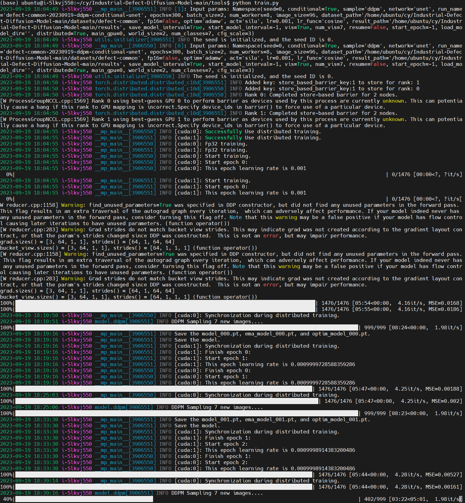

# IDDM：工业缺陷扩散模型

[English Document](README.md)

### 关于模型

该扩散模型为经典的ddpm，来源于论文《**[Denoising Diffusion Probabilistic Models](https://arxiv.org/abs/2006.11239)**》

我们将此项目命名为IDDM: Industrial Defect Diffusion Model，中文名为工业缺陷扩散模型。在此项目中进行模型复现、训练器和生成器编写、部分算法和网络结构的改进与优化，该仓库**持续维护**。

**本仓库整体结构**

```yaml
├── datasets
│   └── dataset_demo
│       ├── class_1
│       ├── class_2
│       └── class_3
├── model
│   ├── modules
│   │   └── module.py
│   ├── networks
│   │   ├── base.py
│   │   ├── cspdarkunet.py
│   │   └── unet.py
│   └── samples
│       ├── base.py
│       ├── ddim.py
│       └── ddpm.py
├── results
├── test
│   ├── noising_test
│   │   ├── landscape
│   │   └── noise
│   └── test_module.py
├── tools
│   ├── deploy.py
│   ├── generate.py
│   └── train.py
├── utils
│   ├── checkpoint.py
│   ├── initializer.py
│   ├── lr_scheduler.py
│   └── utils.py
└── weight
```

### 接下来要做

- [x] 1. 新增cosine学习率优化（2023-07-31）
- [x] 2. 使用效果更优的U-Net网络模型（2023-11-09）
- [x] 3. 更大尺寸的生成图像（2023-11-09）
- [x] 4. 多卡分布式训练（2023-07-15）
- [x] 5. 云服务器快速部署和接口（2023-08-28）
- [x] 6. 增加DDIM采样方法（2023-08-03）
- [x] 7. 支持其它图像生成（2023-09-16）
- [ ] 8. 低分辨率生成图像进行超分辨率增强
- [ ] 9. 使用Latent方式降低显存消耗

### 训练

#### 注意

本自README的训练GPU环境如下：使用具有6GB显存的NVIDIA RTX 3060显卡、具有11GB显存的NVIDIA RTX 2080Ti显卡和具有24GB（总计48GB，分布式训练）显存的NVIDIA RTX 6000（×2）显卡对模型进行训练和测试。**上述GPU均可正常训练**。

#### 开始你的第一个训练（以cifar10为例，模式单卡）

1. **导入数据集** 

   首先，将数据集上传至目标文件夹`datasets`中。上传后文件夹格式（例如：cifar10文件夹下存放着所有类别；class0文件夹下存储着class0这个类别的所有图片）如下方列表所示：
   ```yaml
    datasets
    └── cifar10
        ├── class0
        ├── class1
        ├── class2
        ├── class3
        ├── class4
        ├── class5
        ├── class6
        ├── class7
        ├── class8
        └── class9
   ```

   此时你的训练前准备已经完毕。

2. **设置训练参数**

   打开`train.py`文件，修改`if __name__ == "__main__":`中的`parser`参数；

   设置`--conditional`参数为`True`，因为是多类别训练，所以需要开启，单类别可以不开启也可以开启；

   设置`--run_name`参数为你想创建的文件名称，例如`cifar_exp1`；

   设置`--dataset_path`参数为`/你的/本地/或/远程服务器/文件/地址/datasets/cifar10`；

   设置`--result_path`参数为`/你的/本地/或/远程服务器/文件/地址/results`；

   设置`--num_classes`参数为`10`，这是你的类别总数；

   设置更多参数（自定义），如果报`CUDA out of memory`错误，将`--batch_size`、`--num_workers`调小；

   在自定义参数中，你可以设置不同的`--sample`例如`ddpm`或`ddim`，设置不同的训练网络`--network`例如`unet`或`cspdarkunet`。当然激活函数`--act`，优化器`--optim`，半精度训练`--fp16`，学习率方法`--lr_func`等参数也都是可以自定义设置的。

   详细命令可参考**训练参数**。

3. **等待训练过程**

   点击`run`运行后，项目会在`results`文件夹中生成`cifar_exp1`文件夹，该文件夹中会保存训练日志文件、模型训练文件、模型EMA文件、模型优化器文件、训练的所有最后一次保存的文件和评估后生成的图片。

4. **查看结果**

   找到`results/cifar_exp1`文件夹即可查看训练结果。


**↓↓↓↓↓↓↓↓↓↓下方为多种训练方式、训练详细参数讲解↓↓↓↓↓↓↓↓↓↓**

#### 普通训练

1. 以`landscape`数据集为例，将数据集文件放入`datasets`文件夹中，该数据集的总路径如下`/your/path/datasets/landscape`，图片存放在`/your/path/datasets/landscape/images`，数据集图片路径如下`/your/path/datasets/landscape/images/*.jpg`

2. 打开`train.py`文件，找到`--dataset_path`参数，将参数中的路径修改为数据集的总路径，例如`/your/path/datasets/landscape`

3. 设置必要参数，例如`--sample`，`--conditional`，`--run_name`，`--epochs`，`--batch_size`，`--image_size`，`--result_path`等参数，若不设置参数则使用默认设置。我们有两种参数设置方法，其一是直接对`train.py`文件`if __name__ == "__main__":`中的`parser`进行设置（**我们推荐这种方式**）；其二是在控制台在`/your/path/Defect-Diffiusion-Model/tools`路径下输入以下命令：
   **有条件训练命令**

   ```bash
   python train.py --sample ddpm --conditional True --run_name df --epochs 300 --batch_size 16 --image_size 64 --num_classes 10 --dataset_path /your/dataset/path --result_path /your/save/path
   ```
   **无条件训练命令**

   ```bash
   python train.py --sample ddpm --conditional False --run_name df --epochs 300 --batch_size 16 --image_size 64 --dataset_path /your/dataset/path --result_path /your/save/path
   ```
4. 等待训练即可
5. 若因异常原因中断训练，我们可以在`train.py`文件，首先将`--resume`设置为`True`，其次设置异常中断的迭代编号，再写入该次训练的所在文件夹（run_name），最后运行文件即可。也可以使用如下命令进行恢复：
   **有条件恢复训练命令**

   ```bash
   # 此处为输入--start_epoch参数，使用当前编号权重
   python train.py --resume True --start_epoch 10 --sample ddpm --conditional True --run_name df --epochs 300 --batch_size 16 --image_size 64 --num_classes 10 --dataset_path /your/dataset/path --result_path /your/save/path
   ```
   
   ```bash
   # 此处为不输入--start_epoch参数，默认使用last权重
   python train.py --resume True --sample ddpm --conditional True --run_name df --epochs 300 --batch_size 16 --image_size 64 --num_classes 10 --dataset_path /your/dataset/path --result_path /your/save/path
   ```
   **无条件恢复训练命令**

   ```bash
   python train.py --resume True --start_epoch 10 --sample ddpm --conditional False --run_name df --epochs 300 --batch_size 16 --image_size 64 --dataset_path /your/dataset/path --result_path /your/save/path
   ```
   
   ```bash
   # 此处为不输入--start_epoch参数，默认使用last权重
   python train.py --resume True --sample ddpm --conditional False --run_name df --epochs 300 --batch_size 16 --image_size 64 --dataset_path /your/dataset/path --result_path /your/save/path
   ```

#### 分布式训练

1. 基本配置与普通训练相似，值得注意的是开启分布式训练需要将`--distributed`设置为`True`。为了防止随意设置分布式训练，我们为开启分布式训练设置了几个基本条件，例如`args.distributed`、`torch.cuda.device_count() > 1`和`torch.cuda.is_available()`。

2. 设置必要的参数，例如`--main_gpu`和`--world_size`。`--main_gpu`通常设置为主要GPU，例如做验证、做测试或保存权重，我们仅在单卡中运行即可。而`world_size`的值会与实际使用的GPU数量或分布式节点数量相对应。

3. 我们有两种参数设置方法，其一是直接对`train.py`文件`if __name__ == "__main__":`中的`parser`进行设置；其二是在控制台在`/your/path/Defect-Diffiusion-Model/tools`路径下输入以下命令：

   **有条件训练命令**

   ```bash
   python train.py --sample ddpm --conditional True --run_name df --epochs 300 --batch_size 16 --image_size 64 --num_classes 10 --dataset_path /your/dataset/path --result_path /your/save/path --distributed True --main_gpu 0 --world_size 2
   ```

   **无条件训练命令**

   ```bash
   python train.py --sample ddpm --conditional False --run_name df --epochs 300 --batch_size 16 --image_size 64 --dataset_path /your/dataset/path --result_path /your/save/path --distributed True --main_gpu 0 --world_size 2
   ```

3. 等待训练即可，中断恢复同基本训练一致。




#### 训练参数


**参数讲解**

| **参数名称**           | 条件参数 | 参数使用方法                     | 参数类型 | 参数解释                                                     |
| ---------------------- | :------: | -------------------------------- | :------: | ------------------------------------------------------------ |
| --seed                 |          | 初始化种子                       |   int    | 设置初始化种子，可复现网络生成的图片                         |
| --conditional          |          | 开启条件训练                     |   bool   | 若开启可修改自定义配置，例如修改类别、classifier-free guidance插值权重 |
| --sample               |          | 采样方式                         |   str    | 设置采样器类别，当前支持ddpm，ddim                           |
| --network              |          | 训练网络                         |   str    | 设置训练网络，当前支持UNet，CSPDarkUNet                      |
| --run_name             |          | 文件名称                         |   str    | 初始化模型的文件名称，用于设置保存信息                       |
| --epochs               |          | 总迭代次数                       |   int    | 训练总迭代次数                                               |
| --batch_size           |          | 训练批次                         |   int    | 训练批次大小                                                 |
| --num_workers          |          | 加载进程数量                     |   int    | 用于数据加载的子进程数量，大量占用CPU和内存，但可以加快训练速度 |
| --image_size           |          | 输入图像大小                     |   int    | 输入图像大小，自适应输入输出尺寸                             |
| --dataset_path         |          | 数据集路径                       |   str    | 有条件数据集，例如cifar10，每个类别一个文件夹，路径为主文件夹；无条件数据集，所有图放在一个文件夹，路径为图片文件夹 |
| --fp16                 |          | 半精度训练                       |   bool   | 开启半精度训练，有效减少显存使用，但无法保证训练精度和训练结果 |
| --optim                |          | 优化器                           |   str    | 优化器选择，目前支持adam和adamw                              |
| --act                  |          | 激活函数                         |   str    | 激活函数选择，目前支持gelu、silu、relu、relu6和lrelu         |
| --lr                   |          | 学习率                           |  float   | 初始化学习率，目前仅支持线性学习率                           |
| --lr_func              |          | 学习率方法                       |   str    | 设置学习率方法，当前支持linear、cosine和warmup_cosine        |
| --result_path          |          | 保存路径                         |   str    | 保存路径                                                     |
| --save_model_interval  |          | 是否每次训练储存                 |   bool   | 是否每次训练储存，根据可视化生成样本信息筛选模型             |
| --start_model_interval |          | 设置开始每次训练存储编号         |   int    | 设置开始每次训练存储的epoch编号，该设置可节约磁盘空间，若不设置默认-1，若设置则从第epoch时开始保存每次训练pt文件，需要与--save_model_interval同时开启 |
| --vis                  |          | 可视化数据集信息                 |   bool   | 打开可视化数据集信息，根据可视化生成样本信息筛选模型         |
| --num_vis              |          | 生成的可视化图像数量             |   int    | 生成的可视化图像数量。如果不填写，则默认生成图片个数为数据集类别的个数 |
| --resume               |          | 中断恢复训练                     |   bool   | 恢复训练将设置为“True”。注意：设置异常中断的epoch编号若在--start_model_interval参数条件外，则不生效。例如开始保存模型时间为100，中断编号为50，由于我们没有保存模型，所以无法设置任意加载epoch点。每次训练我们都会保存xxx_last.pt文件，所以我们需要使用最后一次保存的模型进行中断训练 |
| --start_epoch          |          | 中断迭代编号                     |   int    | 设置异常中断的epoch编号，模型会自动加载当前编号的检查点      |
| --distributed          |          | 分布式训练                       |   bool   | 开启分布式训练                                               |
| --main_gpu             |          | 分布式训练主显卡                 |   int    | 设置分布式中主显卡                                           |
| --world_size           |          | 分布式训练的节点等级             |   int    | 分布式训练的节点等级， world_size的值会与实际使用的GPU数量或分布式节点数量相对应 |
| --num_classes          |    是    | 类别个数                         |   int    | 类别个数，用于区分类别                                       |
| --cfg_scale            |    是    | classifier-free guidance插值权重 |   int    | classifier-free guidance插值权重，用户更好生成模型效果       |


### 生成

1. 打开`generate.py`文件，找到`--weight_path`参数，将参数中的路径修改为模型权重路径，例如`/your/path/weight/model.pt`

2. 设置必要参数，例如`--conditional`，`--generate_name`，`--num_images`，`--num_classes`，`--class_name`，`--image_size`，`--result_path`等参数，若不设置参数则使用默认设置。我们有两种参数设置方法，其一是直接对`generate.py`文件`if __name__ == "__main__":`中的`parser`进行设置；其二是在控制台在`/your/path/Defect-Diffiusion-Model/tools`路径下输入以下命令：
   **有条件生成命令**

   ```bash
   python generate.py --conditional True --generate_name df --num_images 8 --num_classes 10 --class_name 0 --image_size 64 --weight_path /your/path/weight/model.pt
   ```

   **无条件生成命令**

   ```bash
   python generate.py --conditional False --generate_name df --num_images 8 --image_size 64 --weight_path /your/path/weight/model.pt
   ```

3. 等待生成即可

#### 生成参数

**参数讲解**

| **参数名称**    | 条件参数 | 参数使用方法                     | 参数类型 | 参数解释                                                     |
| --------------- | :------: | -------------------------------- | :------: | ------------------------------------------------------------ |
| --conditional   |          | 开启条件生成                     |   bool   | 若开启可修改自定义配置，例如修改类别、classifier-free guidance插值权重 |
| --generate_name |          | 文件名称                         |   str    | 初始化模型的文件名称，用于设置保存信息                       |
| --image_size    |          | 输入图像大小                     |   int    | 输入图像大小，自适应输入输出尺寸。如果输入为-1并且开启条件生成为真，则模型为每类输出一张图片 |
| --num_images    |          | 生成图片个数                     |   int    | 单次生成图片个数                                             |
| --weight_path   |          | 权重路径                         |   str    | 模型权重路径，网络生成需要加载文件                           |
| --result_path   |          | 保存路径                         |   str    | 保存路径                                                     |
| --sample        |          | 采样方式                         |   str    | 设置采样器类别，当前支持ddpm，ddim                           |
| --network       |          | 训练网络                         |   str    | 设置训练网络，当前支持UNet，CSPDarkUNet                      |
| --act           |          | 激活函数                         |   str    | 激活函数选择，目前支持gelu、silu、relu、relu6和lrelu。如果不选择，会产生马赛克现象 |
| --num_classes   |    是    | 类别个数                         |   int    | 类别个数，用于区分类别                                       |
| --class_name    |    是    | 类别名称                         |   int    | 类别序号，用于对指定类别生成。如果输入为-1，则模型为每类输出一张图片 |
| --cfg_scale     |    是    | classifier-free guidance插值权重 |   int    | classifier-free guidance插值权重，用户更好生成模型效果       |


### 结果

我们在以下4个数据集做了训练，开启`conditional`，采样器为`DDPM`，图片尺寸均为`64*64`，激活函数为`gelu`，学习率为`3e-4`，采用`线性`学习方法，迭代次数为`300`，分别是`cifar10`，`NEUDET`，`NRSD-MN`和`WOOD`。结果如下图所示：

#### cifar10


#### NEUDET


#### NRSD


#### WOOD


#### Animate face（整活生成）


### 部署

未完待续

### 致谢

[@dome272](https://github.com/dome272/Diffusion-Models-pytorch)

[@OpenAi](https://github.com/openai/improved-diffusion)

